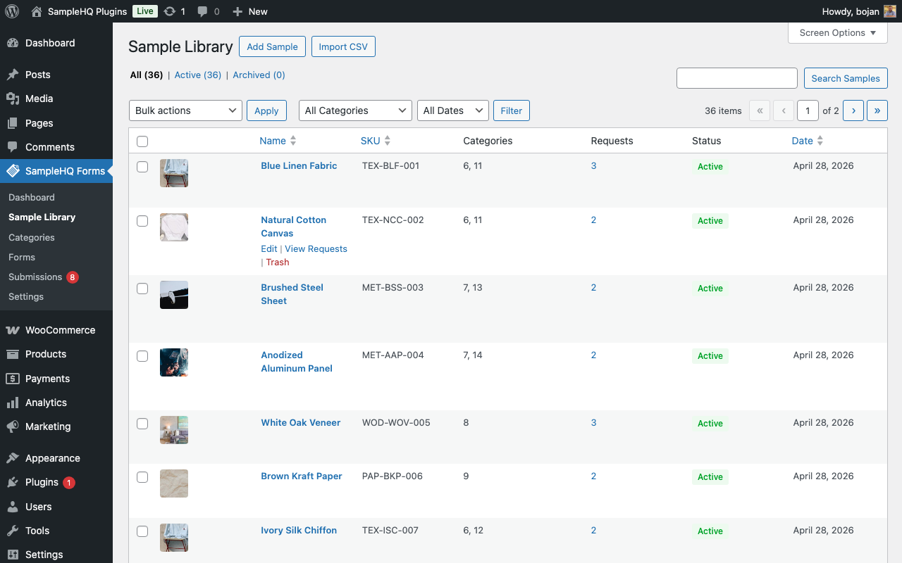
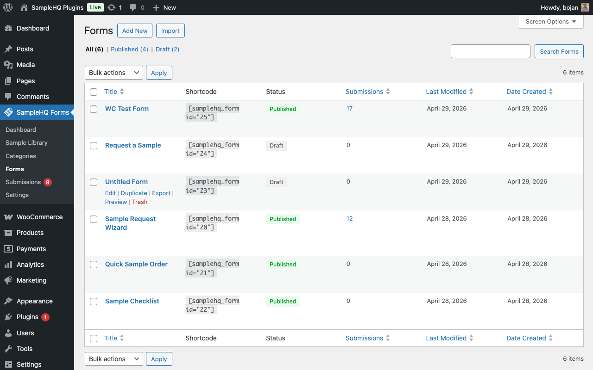
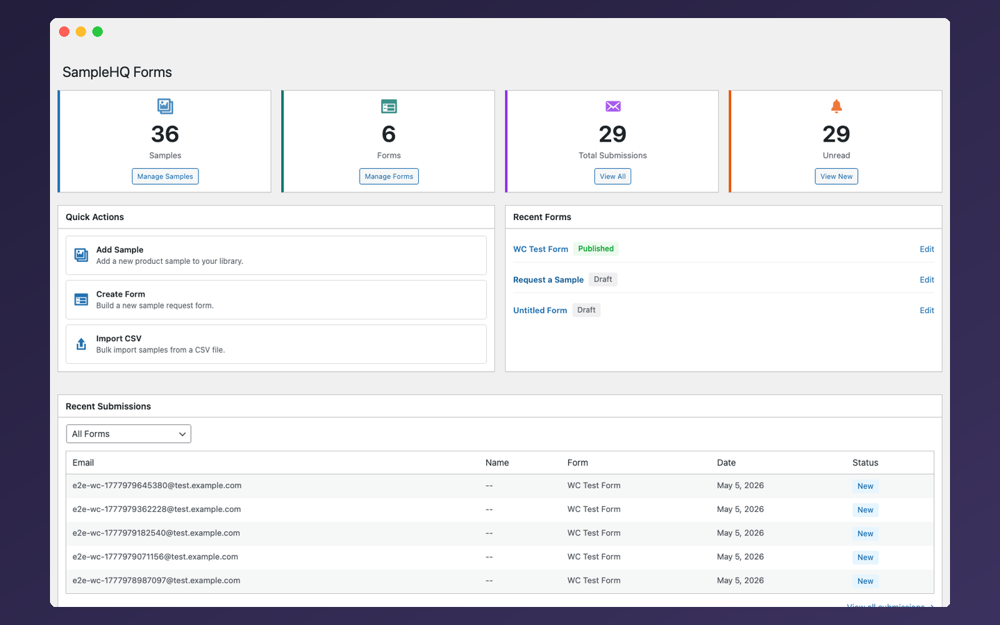
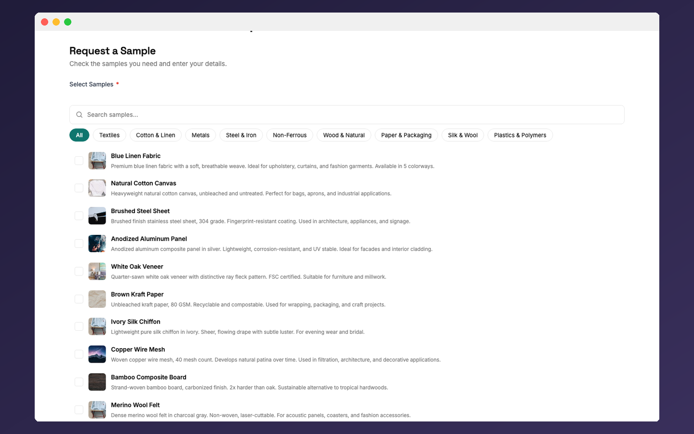
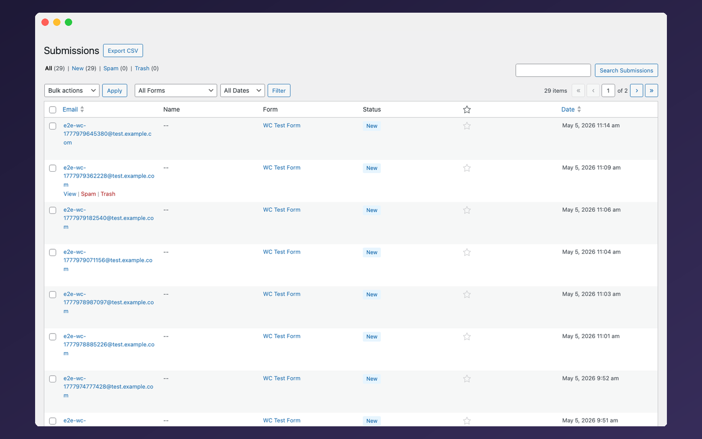
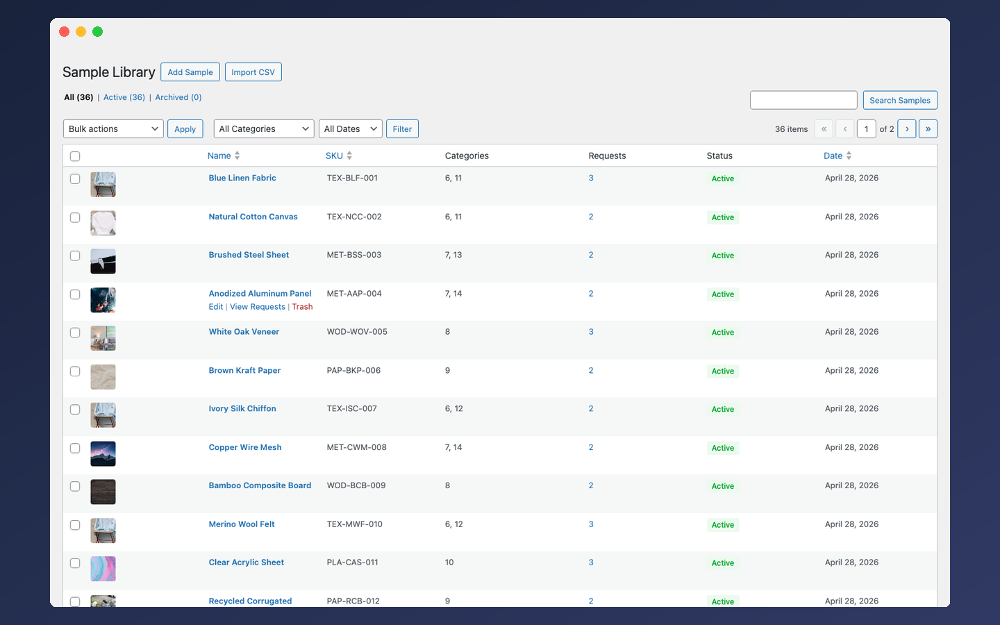
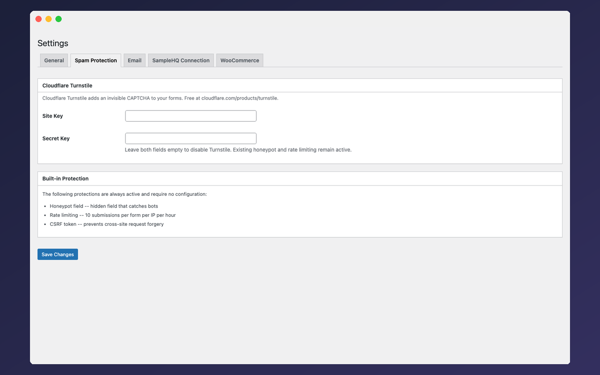

# SampleHQ Request Form

[](https://github.com/codeverbojan/samplehq-request-form/actions/workflows/ci.yml)
[](https://www.php.net/)
[](https://wordpress.org/)
[](https://www.gnu.org/licenses/gpl-2.0.html)

A WordPress plugin purpose-built for collecting structured product sample requests.

Generic contact forms are not built for sample workflows. SampleHQ Request Form gives you a dedicated sample library, a visual form builder, a unique sample picker field, and a submissions dashboard -- all local to your WordPress site.

Use it when you need a lightweight WordPress intake system. Use the full [SampleHQ platform](https://samplehq.io) when you need fulfillment tracking, CRM attribution, analytics, team workflows, and revenue visibility.

---

## Current Status

SampleHQ Request Form is in final review before WordPress.org submission. The plugin is suitable for local testing and developer review, but a packaged public release has not been published yet.

Do not use this on production sites with real customer data until a tagged release has been published and tested in your environment.

---

## At a Glance

- **Purpose:** Collect structured product sample requests in WordPress
- **Best for:** B2B manufacturers, packaging companies, material suppliers, flooring companies, and WooCommerce stores
- **Embeds:** Shortcode, Gutenberg block, Elementor widget
- **Data:** Stored locally in WordPress -- no external service required
- **SaaS required:** No
- **Status:** Final review before WordPress.org submission

---

## What This Plugin Does

1. You build a **sample library** -- your products with images, SKUs, categories, and descriptions.
2. You create a **request form** with a drag-and-drop builder. The form includes a sample picker that pulls directly from your library.
3. Visitors browse your samples, select what they want (with quantities), fill in their details, and submit.
4. You see every request in a **submissions dashboard** with filters, search, star/unread tracking, and CSV export.

No external accounts. No API keys. No quotas. Install and go.

---

## Who Is This For

- **Packaging and labeling manufacturers** -- corrugated, poly bags, mailers, shrink wrap
- **Material suppliers** -- textiles, metals, wood, composites, plastics
- **Flooring companies** -- hardwood, tile, vinyl, carpet samples
- **Building material suppliers** -- countertops, stone, concrete, insulation
- **WooCommerce stores** -- use your existing product catalog as the sample source
- **Any B2B company** that sends physical product samples as part of their sales process

If you're currently using a generic contact form for sample requests and wishing it understood products, this is for you.

---

## Why Not a Normal Form Plugin?

Generic form plugins collect text. Sample requests are product-based.

A real sample request workflow needs product images, SKUs, categories, quantities, structured selections, request history, exportable submissions, and optional WooCommerce product sourcing.

SampleHQ Request Form is built around that workflow from the start.

---

## Demo Flow

1. Create sample records with images, SKUs, categories, and descriptions.
2. Build a request form using the Sample Picker field.
3. Embed the form on a product, landing, or catalog page.
4. Visitors select samples and submit their details.
5. Manage, filter, star, export, or follow up on requests from WordPress.

---

## Key Features

### Sample Library
Manage your products in a dedicated admin screen. Each sample has a name, SKU, description (rich text), categories, multiple images, and custom key-value fields (weight, dimensions, material, etc.). Bulk import via CSV.

### Visual Form Builder
Drag-and-drop builder with 17 field types. Multi-column rows, conditional logic (show/hide fields based on values), multi-step wizard layout, and per-form email notification settings.

**Field types:** Text, Email, Phone, Paragraph, Number, Date, URL, Dropdown, Radio, Checkbox, Name (first + last), Address (composite), File Upload, Hidden, HTML Content, Consent/GDPR, Page Break, and the unique **Sample Picker**.

### Sample Picker Field
The field that makes this plugin different from every generic form builder. It reads directly from your sample library (or WooCommerce products) and renders as:
- **Card grid** -- product cards with images, descriptions, and category tabs
- **Checklist** -- compact list with checkboxes and descriptions
- **List view** -- searchable list with category filtering

Visitors select samples, optionally set quantities, and their choices are stored as structured data -- not free text in a textarea.

### Submissions Dashboard
Every submission is stored locally. Filter by form, date range, or status. Search by email or name. Star important requests. Mark read/unread. Bulk actions for spam, trash, restore, delete. Export filtered results to CSV (UTF-8, Excel-compatible, formula injection prevention).

### Embed Anywhere
- **Gutenberg block** -- search "SampleHQ Form" in the block inserter, pick a form, live preview in the editor
- **Elementor widget** -- appears automatically when Elementor is active, form selector in the widget panel
- **Shortcode** -- `[samplehq_form id="123"]` works with any page builder (Divi, Beaver Builder, Classic Editor, etc.)

### WooCommerce Integration
When WooCommerce is active, a new settings tab appears. Enable it and the sample picker uses your WooCommerce products instead of the built-in library. A "Request a Sample" button is added to product pages. Filter which product categories are available for sampling.

### Spam Protection
Three layers always active with zero configuration: honeypot field, IP-based rate limiting (10 per form per hour), and CSRF token validation. Optionally add Cloudflare Turnstile (free invisible CAPTCHA) for an additional layer.

### Privacy and GDPR
- Consent checkbox field type for GDPR compliance
- IP address collection is toggleable (off = no IP stored at all)
- Configurable IP retention period with automatic purging via wp-cron
- Full WordPress Privacy API integration: personal data export and erasure by email

### Accessibility
Built with WCAG 2.2 Level AA accessibility practices in mind, including proper labels, keyboard navigation, visible focus states, screen reader announcements, and reduced-motion support.

---

## Screenshots

<p align="center">
  <br />
  <strong>Visual Form Builder</strong> -- drag-and-drop with field palette, sample picker, multi-column rows, form settings panel
</p>

<p align="center">
  <br />
  <strong>Frontend Form (Card Grid)</strong> -- sample picker with product images, category tabs, and descriptions
</p>

<p align="center">
  <br />
  <strong>Dashboard</strong> -- stat cards, quick actions, recent forms, recent submissions
</p>

<p align="center">
  <br />
  <strong>Frontend Form (List View)</strong> -- checklist layout with category tabs and search
</p>

<p align="center">
  <br />
  <strong>Submissions Dashboard</strong> -- filter, search, star, bulk actions, CSV export
</p>

<p align="center">
  <br />
  <strong>Sample Library</strong> -- products with images, SKUs, categories, request counts, and status
</p>

<p align="center">
  <br />
  <strong>Settings</strong> -- tabs for General, Spam Protection, Email, SampleHQ Connection, and WooCommerce
</p>

---

## Installation

This plugin has not been published to WordPress.org yet. It is in final review before submission.

**For local testing:**

```bash
git clone https://github.com/codeverbojan/samplehq-request-form.git
cd samplehq-request-form
composer install
npm install && npm run build
```

Then place the plugin folder in `wp-content/plugins/` and activate "SampleHQ Request Form" from the WordPress admin.

### Requirements
- WordPress 6.0+
- PHP 8.0+
- WooCommerce 8.0+ (optional, for product integration)

---

## Quick Start

**Step 1: Add samples to your library**
Go to **SampleHQ Forms > Sample Library > Add Sample**. Enter a name, SKU, description, category, and upload an image. Repeat for each product. Or use **Import CSV** to bulk import.

**Step 2: Create a form**
Go to **SampleHQ Forms > Forms > Create Form**. Choose a template (Wizard, Grid, Checklist, or Blank). The form builder opens with a field palette on the left and a canvas in the center. Drag fields onto the canvas. Add a **Sample Picker** field -- it automatically pulls from your library. Configure form settings (layout, submit button text, success message) in the right panel. Click **Save**.

**Step 3: Embed the form on a page**
Use any of the three embed methods:
- **Gutenberg:** Add a block, search "SampleHQ Form", select your form
- **Elementor:** Add the SampleHQ Form widget, select your form
- **Shortcode:** Paste `[samplehq_form id="123"]` (replace 123 with your form ID, visible in the form list)

**Step 4: Receive and manage submissions**
Submissions appear under **SampleHQ Forms > Submissions**. You'll also get email notifications (configurable under **Settings > Email**). Filter, search, star, and export as needed.

---

## Shortcode Usage

```
[samplehq_form id="123"]
```

| Attribute | Required | Description |
|-----------|----------|-------------|
| `id` | Yes | The form ID (shown in the Forms list table and in the form builder sidebar under "Info") |

The shortcode works in posts, pages, widgets, and any page builder that supports WordPress shortcodes. Frontend CSS and JS are loaded only on pages where the shortcode is present.

---

## Gutenberg Block

Search for **"SampleHQ Form"** in the block inserter (or browse the "SampleHQ Forms" block category). Select a published form from the dropdown in the block inspector. The block renders a live server-side preview in the editor.

---

## Elementor Widget

When Elementor is active, a **SampleHQ Form** widget appears in the Elementor panel. Drag it onto your page, select a form from the dropdown, and publish. The widget uses the same rendering as the shortcode and block.

---

## WooCommerce Integration

When WooCommerce 8.0+ is active:

1. A **WooCommerce** tab appears under **SampleHQ Forms > Settings**
2. Enable "Use WooCommerce products as sample source"
3. Optionally filter by product categories (only show specific categories in the sample picker)
4. A **"Request a Sample"** button is added to WooCommerce single product pages
5. The sample picker field in your forms now shows WooCommerce products with their images, prices, and descriptions

The built-in sample library still works alongside WooCommerce -- you choose which source each form's sample picker uses.

---

## Email Notifications

Two emails are sent on each submission (both configurable):

1. **Admin notification** -- sent to the site admin (or custom recipients). Includes all submitted data with a link to the submission in wp-admin. Supports Reply-To so you can respond directly to the requester.
2. **Submitter confirmation** -- optional auto-reply sent to the person who filled out the form. Confirms their request was received and lists what they submitted.

Configure global defaults under **Settings > Email**. Override per-form in the form builder's Email Notifications panel.

### Email Hooks for Developers

```php
// Customize admin notification content
add_filter( 'shqf_admin_notification_content', function( $body, $submission, $meta, $form ) {
    return $body;
}, 10, 4 );

// Customize admin notification subject
add_filter( 'shqf_admin_notification_subject', function( $subject, $submission, $form ) {
    return $subject;
}, 10, 3 );

// Customize submitter confirmation content
add_filter( 'shqf_confirmation_email_content', function( $body, $submission, $meta, $form ) {
    return $body;
}, 10, 4 );
```

---

## Privacy and GDPR

| Setting | Location | Default |
|---------|----------|---------|
| IP address collection | Settings > General | On |
| IP retention period | Settings > General | 90 days |
| Consent field | Form builder (add a Consent field) | -- |
| Personal data export | Tools > Export Personal Data | Automatic |
| Personal data erasure | Tools > Erase Personal Data | Automatic |

When a privacy request comes in through WordPress, the plugin automatically finds all submissions matching the email address and includes them in the export or deletes them (including all meta, rate limit records, and uploaded files).

Disable IP collection entirely if you don't need it -- the plugin stores NULL instead.

---

## Developer Hooks

The plugin provides filters for customization without modifying core files:

| Hook | Type | Description |
|------|------|-------------|
| `shqf_admin_notification_content` | filter | Customize admin email body |
| `shqf_admin_notification_subject` | filter | Customize admin email subject |
| `shqf_confirmation_email_content` | filter | Customize confirmation email body |
| `shqf_client_ip` | filter | Override client IP detection (useful behind proxies/CDNs) |
| `shqf_rate_limit` | filter | Change rate limit threshold (default: 10) |
| `shqf_rate_window` | filter | Change rate limit window in seconds (default: 3600) |
| `shqf_load_google_fonts` | filter | Disable Google Fonts loading (return `false`) |
| `shqf_woo_show_variations` | filter | Show WooCommerce product variations in sample picker |

---

## Developer Setup

### Requirements
- PHP 8.0+, Composer 2.x, Node.js 18+, Docker

### Setup
```bash
git clone git@github.com:codeverbojan/samplehq-request-form.git
cd samplehq-request-form
composer install
npm install
npm run build
```

### Local Environment
```bash
npx wp-env start          # WordPress at http://localhost:8888 (admin / password)
npx wp-env stop           # Stop
npx wp-env clean all      # Reset database
```

### Building Assets
```bash
npm run build             # Production build -> assets/build/
npm run start             # Development mode with file watching
```

---

## Testing

The plugin has 683 unit tests, 29 integration tests, and 27 E2E spec files across 18,000+ lines of PHP source and 18,000+ lines of test code.

```bash
# Unit tests (no WordPress needed, fast)
composer test

# Integration tests (needs wp-env running)
composer test:integration

# E2E browser tests (needs wp-env running)
npx playwright test

# Linting and static analysis
composer lint              # PHPCS (WordPress Coding Standards)
composer analyze           # PHPStan level 6
npm run lint:js            # ESLint (@wordpress/eslint-plugin)
npm run lint:css           # Stylelint (@wordpress/stylelint-config)

# Run everything
composer check             # PHP lint + PHPStan + unit tests
```

### Code Quality Standards
- **PHP:** WordPress Coding Standards (WPCS) via PHPCS, PHPStan level 6
- **JavaScript:** `@wordpress/eslint-plugin`
- **CSS:** `@wordpress/stylelint-config`
- **PHP 8.0+ strict types:** every file starts with `declare(strict_types=1)`
- **PSR-4 autoloading:** `SampleHQForm\` namespace maps to `src/`

See [CONTRIBUTING.md](CONTRIBUTING.md) for the full pull request process.

---

## Project Structure

```
src/                       73 PHP source files, 18,000+ lines
  Admin/                   Admin pages, list tables, settings, dashboard
  Api/                     REST API (public submission + admin CRUD endpoints)
  Blocks/                  Gutenberg block (block.json, server-side render)
  Database/                8 custom tables, versioned migrations
  Elementor/               Elementor widget (conditional registration)
  Email/                   Mailer service (admin notification + confirmation)
  Export/                  CSV export, CSV import, JSON form import/export
  Fields/                  17 field types including Sample Picker
  Forms/                   Form rendering, server-side validation, submission processing
  Helpers/                 Asset loading, sanitization
  Privacy/                 GDPR data export and erasure
  Spam/                    Honeypot, rate limiting, Turnstile integration
tests/                     86 test files, 18,000+ lines
  Unit/                    683 PHPUnit tests (mocked WordPress, fast)
  Integration/             29 PHPUnit tests (real WordPress via wp-env)
  e2e/                     27 Playwright spec files (admin, frontend, WooCommerce, responsive)
```

---

## Roadmap

### Target v1.0.0 Scope
- Sample library with categories, images, custom fields, CSV import
- Visual form builder with 17 field types
- Sample picker (card grid, checklist, list view)
- Conditional logic, multi-step wizard forms
- File upload with protected storage
- Gutenberg block, Elementor widget, shortcode
- WooCommerce product integration
- Submissions dashboard with search, filters, bulk actions, CSV export
- Email notifications (admin + submitter confirmation)
- Spam protection (honeypot, rate limiting, Turnstile)
- Privacy API integration (export + erasure)
- Accessibility (WCAG 2.2 AA practices)
- Form import/export (JSON), form duplication

### Post-launch (v1.x)
- **SampleHQ platform connection** -- sync submissions to the SampleHQ platform for approval workflows, CRM integration, shipping labels, and revenue attribution
- Data migration wizard (samples, categories, and submission history to the platform)

### v2
- **Form builder migration** -- import existing sample request data from Gravity Forms, Contact Form 7, WPForms, Ninja Forms, Formidable Forms, and Fluent Forms into SampleHQ Request Form, with automatic sample library creation from imported submission data

---

## SampleHQ Request Form vs. SampleHQ

**SampleHQ Request Form** is the lightweight WordPress intake plugin. Use it when you only need to collect structured sample requests on a WordPress site.

**SampleHQ** is the full sample management platform. Use it when you need sample fulfillment tracking, team workflows, approval pipelines, CRM attribution (Salesforce/HubSpot), shipping labels (Shippo), analytics, revenue visibility, and multi-user dashboards.

**The upgrade path:** Install this plugin, build your sample library, collect requests. When you outgrow WordPress-only management, SampleHQ will provide a migration path for samples, categories, and submission history.

The plugin works fully standalone. No SampleHQ account is ever required. No features degrade over time. No submission quotas.

---

## License

GPL-2.0-or-later. See [LICENSE](LICENSE).
